# ***DSA3050A_MidSem_Snit_670552***

# ***Mid-Semester Practical Examination***

## **Business Intelligence Project using Microsoft Power BI**


## ***Student Information***

***Student Name:*** *Snit Kahsay Teshome*

***Student ID:*** *670552*

***Course:*** *DSA 3050A - Business Intelligence*

***Submission Date:*** *June 2025*

***Repository Name:*** *DSA3050A_MidSem_Snit_670552*

---


## ***Dataset Description***

***Dataset Title:*** *Crime Data from 2020 to Present — Los Angeles Police Department (LAPD)*

***Primary Source:*** *Los Angeles Open Data Portal (Official Government Source)*

***Source URL:*** *https://data.lacity.org/Public-Safety/Crime-Data-from-2020-to-Present/2nrs-mtv8*

***Number of Rows:*** *358,750 crime incident records (after filtering 2023 to 2024 records only)*

***Number ofColumns :*** *28 columns*

***Data Nature:*** *Real-world incident reports transcribed directly from original LAPD paper crime reports.While it is  large  dataset  to dowload  we  used  direct powerbi importing using  web:*
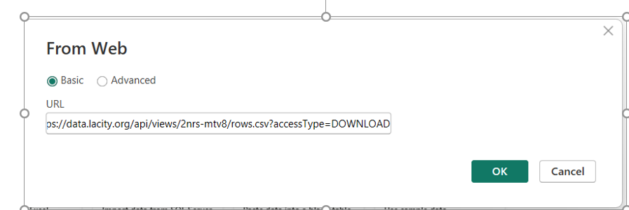

---


## ***Business Problem Being Analyzed***

*You have been hired as a Business Intelligence Analyst for the Los Angeles Police Department (LAPD). Department management has provided a large raw dataset of crime incident records containing errors, inconsistencies, missing values, and poorly structured fields. The dataset covers all reported crime incidents across 21 LAPD operational divisions for the years 2023 and 2024.*

*The objective of this project is to clean and transform the dataset using Power Query, then build a professional Power BI dashboard that enables LAPD leadership to make data-driven decisions on the following business questions:*

- *Which geographic districts record the highest crime volumes and require priority resource deployment?*
- *What is the overall case resolution rate, and where are the investigative bottlenecks?*
- *Are there seasonal or temporal patterns in crime that should inform patrol scheduling and budget planning?*
- *How are victims distributed across demographic categories, and which groups face the highest risk exposure?*
- *What crime severity categories dominate the caseload, and how do they relate to reporting delays?*

---

## ***Repository Structure***
```
DSA3050A_MidSem_Snit_670552/
│
├── Dataset/
│   └──https://data.lacity.org/Public-Safety/Crime-Data-from-2020-to-Present/2nrs-mtv8                
│
├── PBIX/
│   └── MidSemExam.pbix                       
│
├── Screenshots/
│   ├── 01_row_processing/                     (Raw data import screenshots)
│   │   ├── 01_load_from_web.png
│   │   ├── 02_raw_dataset.png
│   │   ├── 03_filter_selection.png
│   │   └── 04_LA_Crime_2Years_Filtered.png
│   │
│   ├── 02_cleaning/                           (Section A - Basic Cleaning)
│   │   ├── 01_column_renaming.png
│   │   ├── 02_applied_data_types.png
│   │   ├── 03_remove_duplicates.png
│   │   ├── 04_remove_blank_rows.png
│   │   ├── 05_trim_clean_text.png
│   │   ├── 06_replace_inconsistent_values.png
│   │   ├── 07_remove_unnecessary_columns.png
│   │   ├── column_Distribution.png
│   │   ├── power_query_editor.png
│   │   ├── Sample_dataType.png
│   │   └── Sample_renaming.png
│   │
│   ├── 03_Intermediate_Transformations/       (Section B - Intermediate Transformations)
│   │   ├── 01_split_crime_time.png
│   │   ├── 02_merge_columns.png
│   │   ├── 03_create_custom_columns_1.png
│   │   ├── 03_create_custom_columns_2.png
│   │   ├── 03_create_custom_columns_3.png
│   │   ├── 04_create_conditional_columns_1.png
│   │   ├── 04_create_conditional_columns_2.png
│   │   ├── 05_extract_date_components_Day.png
│   │   ├── 05_extract_date_components_Month.png
│   │   ├── 05_extract_date_components_Year.png
│   │   ├── 05_extract_date_components_Quarter.png
│   │   ├── 06_filter_rows_conditions_1.png
│   │   ├── 06_filter_rows_conditions_2.png
│   │   ├── 07_add_index_column.png
│   │   ├── 08_sort_data.png
│   │   ├── Applied_steps.png
│   │   └── Split_sample.png
│   │
│   ├── 04_Advanced_Power_Query/               (Section C - Advanced Tasks)
│   │   ├── 01_merge_queries_1.png
│   │   ├── 01_merge_queries_2.png
│   │   ├── 01_merge_queries_3.png
│   │   ├── 01_merge_queries_4.png
│   │   ├── 02_nested_conditionals_1.png
│   │   ├── 02_nested_conditionals_2.png
│   │   ├── 03_group_by_aggregations.png
│   │   ├── 03_group_by_aggregations_output.png
│   │   ├── 04_create_date_table.png
│   │   ├── 04_create_date_table_output.png
│   │   ├── 05_column_profiling_1.png
│   │   ├── 05_column_profiling_2.png
│   │   ├── 05_column_profiling_3.png
│   │   └── 05_column_profiling_4.png
│   │
│   ├── 05_Powerbi_visualizations/             (Question 2 - Dashboard Visuals)
│   │   ├── 01_coverpage.png
│   │   ├── 02_OverviewOf_LA_crime_Analysis.png
│   │   ├── 03_Pattern_Resolution_Analysis.png
│   │   ├── 04_Temporal_Analysis.png
│   │   └── 05_Geographical_Crime_Analysis.png
│   │
│   └── 06_Dashboard_Interactivity/            (Question 3 - Interactivity)
│       ├── 01_Slicer_1.png
│       ├── 01_Slicer_2.png
│       ├── 01_Slicer_3.png
│       ├── 02_Drilldown_1.png
│       └── 02_Drilldown_2.png
│
├── Insight.pdf
│ 
│
├── PowerQuery_Evidence/
│   └── Applied_Steps_Final.png
│
├── .gitignore
├── LICENSE
└── README.md
```

## ***Question 1: Power Query Transformations Performed***

### ***Section A: Basic Data Cleaning***

***A.1 — Renamed Unclear Columns*** 

- *DR_NO to Case ID*,*DATE OCC to Crime Date*,*TIME OCC to Crime Time*,*AREA NAME to Area*,*Crm Cd to Crime Code*,*Crm Cd Desc to Crime Description*, *Vict Age to Victim Age*,*Vict Sex to Victim Sex*,*Premis Cd to Premise Code*, *Premis Desc to Premise Description*,*Weapon Desc to Weapon Description*,*Status Desc to Status Description* 
*Screenshots: 02_cleaning/01_column_renaming.png, 02_cleaning/Sample_renaming.png*


***A.2 — Changed Data Types Correctly*** 

- *Crime Date and Report Date converted to Date type*
- *Crime Time, Area Code, Reporting District, Crime Code, Weapon Code, and Premise Code converted to Whole Number*
- *Latitude and Longitude converted to Decimal Number*
- *All descriptive and categorical fields including Area Name, Crime Description, Victim Sex, Victim Descent, Premise Description, Weapon Description, and Status Description retained as Text type*

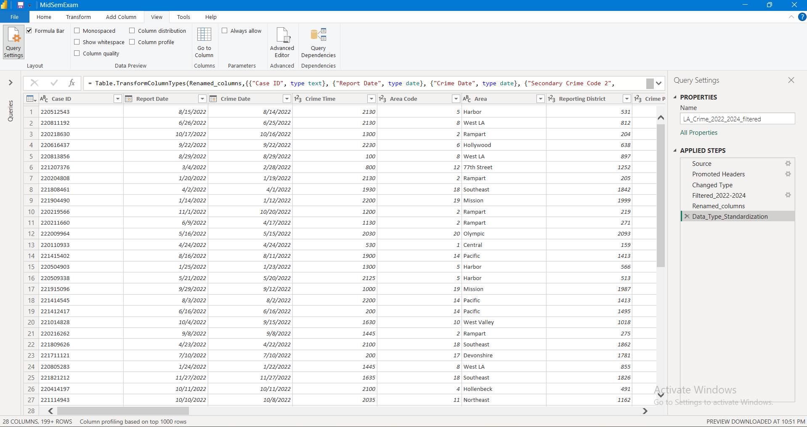

***A.3 — Removed Duplicate Records*** 

*This retained only unique crime incident records and ensured the Case ID field functioned as a reliable unique identifier for each reported incident.*


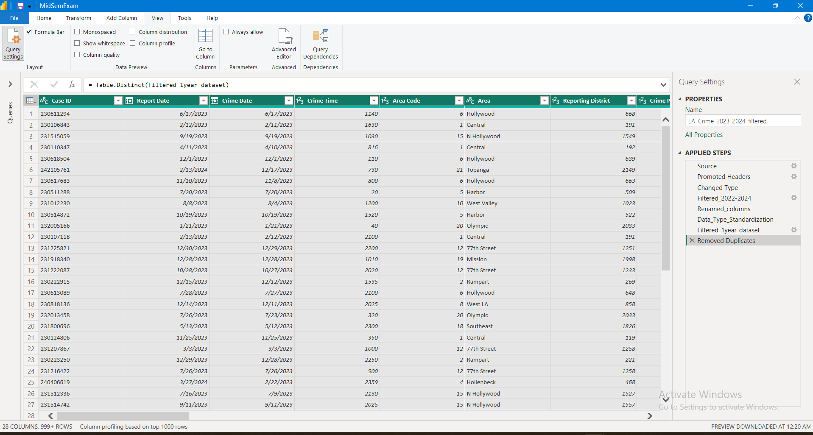

***A.4 — Removed Blank Rows*** 

*Empty rows and records with missing critical identifiers were removed using the Remove Blank Rows transformation.*

***A.5 — Trimmed and Cleaned Text Columns*** 

*Area Name, Premise Description, Weapon Description, Status Description, Location, and Cross Street.*

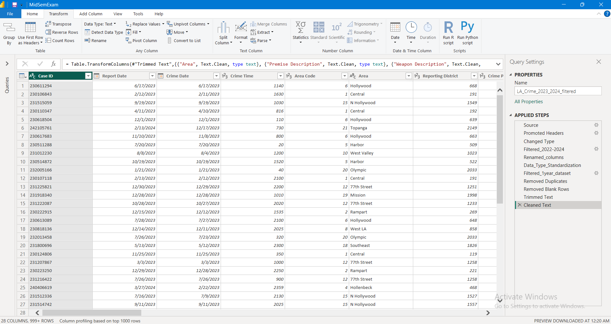

---

***A.6 — Replaced Inconsistent Values*** 

- *Victim Sex spacing inconsistencies corrected: " M" replaced with "M", "F " replaced with "F", "X " replaced with "X"*
- *Missing Weapon Description values replaced with the label "No Weapon Used"*
- *Missing Premise Description values replaced with the label "Unknown Premise"*


***A.7 — Removed Unnecessary Columns*** 

*The dataset was reduced from 30 columns to 22 columns by dropping the following fields: MO Codes, Secondary Crime Code 1, Secondary Crime Code 2, Secondary Crime Code 3, and Cross Street.*
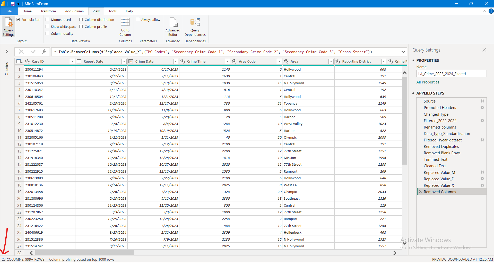


### ***Section B: Intermediate Transformations***


***B.1 — Split Column: Crime Time into Hour and Minute*** 

*The Crime Time column, which stored time values as a four-digit integer (for example 1430 representing 2:30 PM), was split into two separate columns: Crime Hour and Crime Minute. Both resulting columns were renamed appropriately and their data types were set to Whole Number.*

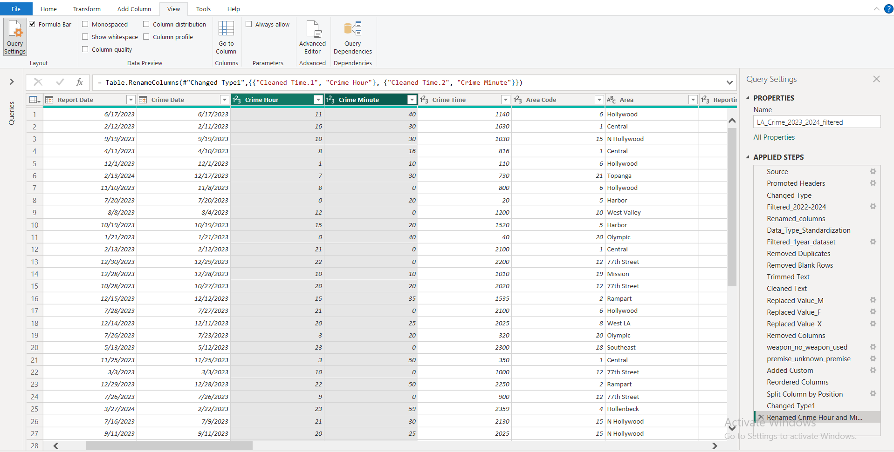

***B.2 — Merge Columns: Crime DateTime*** *(2 Marks)*

*The Crime Date and Crime Time columns were merged into a single unified column named Crime DateTime. The resulting merged field was formatted as "YYYY-MM-DD HH:MM" (for example "2023-01-15 14:30") and its data type was set to Date/Time to enable temporal filtering and time-intelligence operations.*


***B.3 — Created Custom Columns*** 

*Custom Column 1 — Time of Day: Derived from the Crime Hour column. Values of 0 through 5 were labeled "Night", 6 through 11 were labeled "Morning", 12 through 17 were labeled "Afternoon", and 18 through 23 were labeled "Evening".*

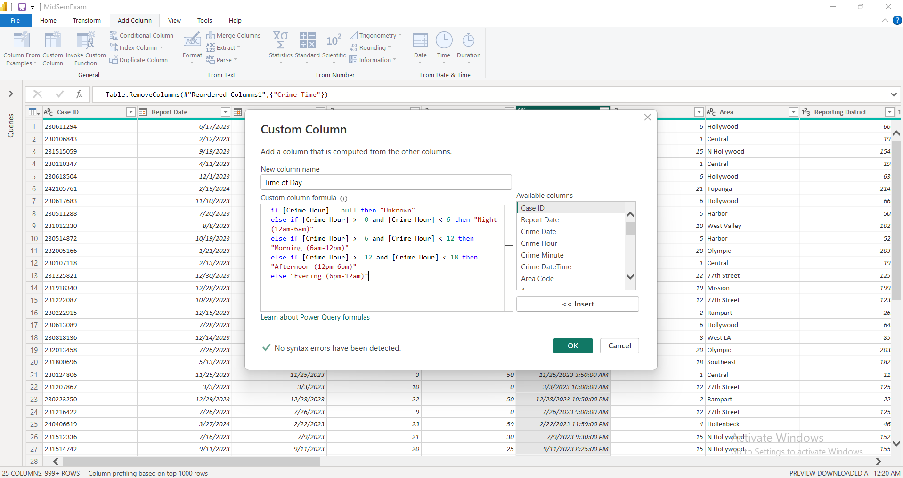

*Custom Column 2 — Days to Report: Calculated by subtracting the Crime Date from the Report Date, producing a numeric count of how many calendar days elapsed before each incident was officially logged in the system.*

*Custom Column 3 — Victim Category: Derived from the Victim Age column. Ages below 0 or null values were labeled "Invalid", ages 0 through 17 were labeled "Minor", ages 18 through 64 were labeled "Adult", and ages 65 and above were labeled "Senior".*

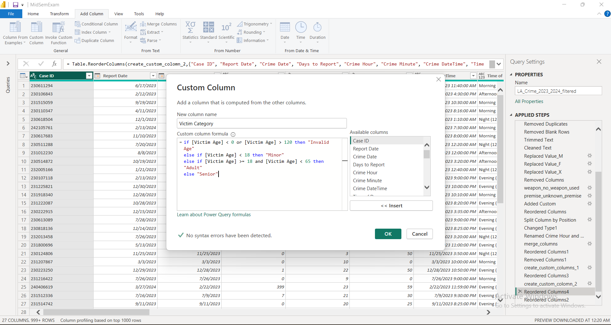


***B.4 — Created Conditional Columns*** *(3 Marks)*

*Two conditional columns were created using the Add Conditional Column interface:*

*Conditional Column 1 — Crime Severity: Based on the Crime Code field, incidents were categorized into three operational tiers. Crime codes associated with violent felonies were labeled "High", codes associated with property offenses were labeled "Medium", and all remaining codes were labeled "Low".*

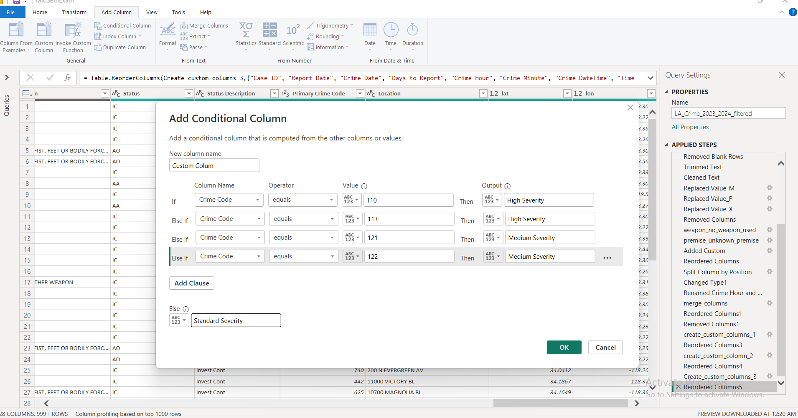

*Conditional Column 2 — Is Night Crime: Based on the Crime Hour column. Hours between 20 and 23 or between 0 and 5 were labeled "Yes" (night crime). All other hours were labeled "No".*


***B.5 — Extracted Date Components***

*Four individual date attribute columns were extracted from the Crime Date column using the Power Query Date extraction functions:*

- *Crime Year: Extracted the 4-digit calendar year (2023 or 2024)*
- *Crime Month: Extracted the numeric month value (1 through 12)*
- *Crime Day: Extracted the numeric day of the month (1 through 31)*
- *Crime Quarter: Constructed the quarter label as "Q1", "Q2", "Q3", or "Q4" using the formula "Q" concatenated with the rounded-up result of month divided by 3*
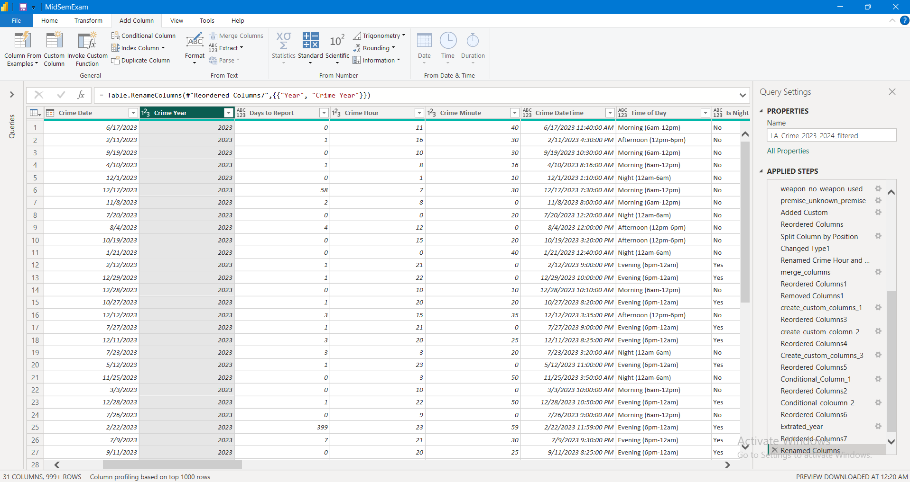

***B.6 — Filtered Rows Using Two Conditions*** 

*Two sequential row filters were applied to remove statistically invalid records:*

- *Filter 1: Retained only rows where Victim Age is greater than or equal to 0 (removed negative age entries)*
- *Filter 2: Retained only rows where Victim Age is less than or equal to 120 (removed biologically implausible age values)*
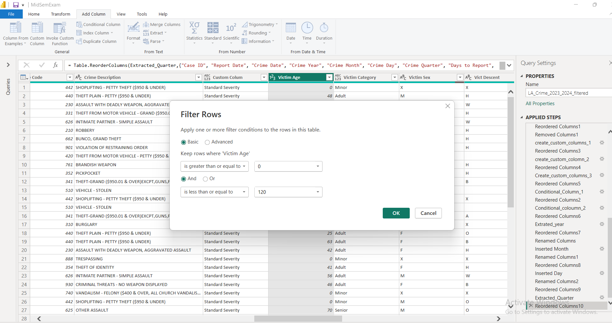

*A third filter was applied to confirm valid Status Description values, retaining only rows with recognized investigative status labels.*

***B.7 — Sorted Data Meaningfully*** 

*The dataset was sorted by Crime Date in ascending order (oldest to most recent) as the primary sort key.*
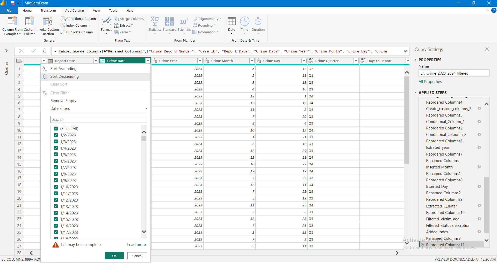


***B.8 — Added Index Column*** 

*An index column named Crime Record Number was added to the dataset using the Add Index Column function set to start at 1. The column was positioned as the first column in the table.*
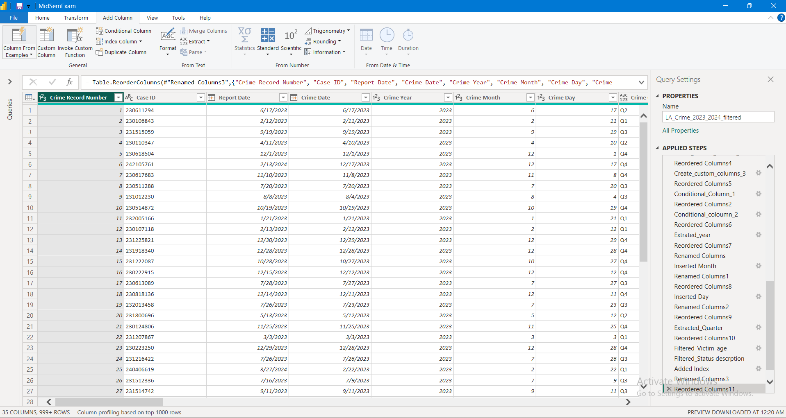

### ***Section C: Advanced Power Query Tasks***


***C.1 — Merge Queries Using a Common Key***

*A new reference table named Area Lookup was created by extracting all distinct Area Name values from the main crime dataset. This produced a clean dimensional lookup table containing the 9 unique LAPD operational division names without repetition. The Area Lookup table was then merged back into the main crime query using a Left Outer Join on the Area Name column as the common key. This merge operation appended the structured area dimension to the main fact table.*

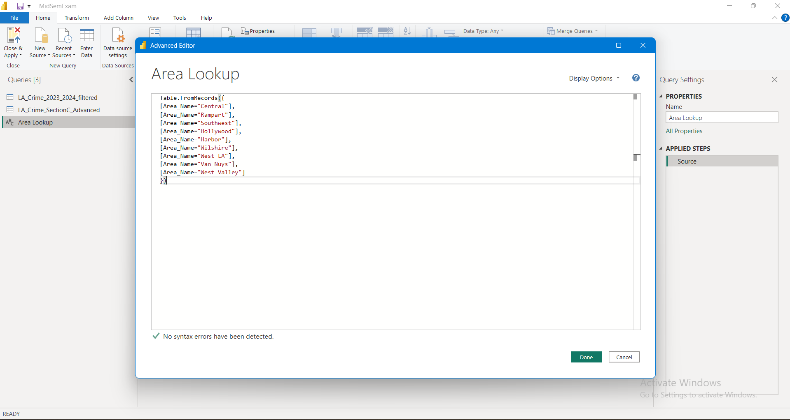

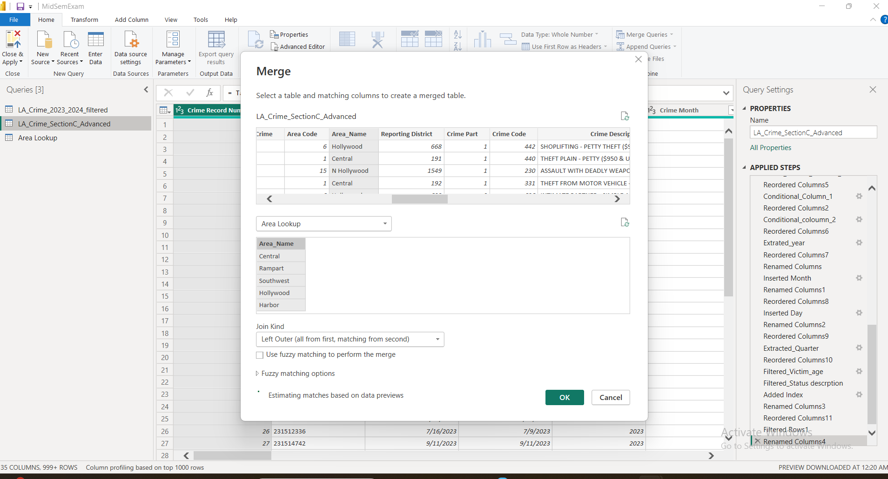

***C.2 — Business Categories Using Nested Conditional Logic*** *(5 Marks)*

*Two advanced nested conditional columns were created using M formula logic:*

*Nested Column 1 — Crime Severity Category: code of exactly 110 was labeled "Homicide". Codes of 113 or 121 were labeled "Violent Crime". Codes of 210 or 220 were labeled "Property Crime". A code of exactly 330 was labeled "Robbery". All remaining codes were labeled "Other Crime".*

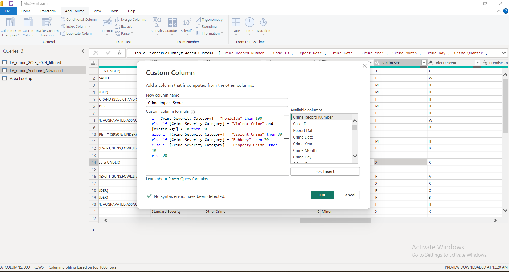

*Nested Column 2 — Crime Impact Score: Applied a further nested formula evaluating both the Crime Severity Category and Victim Age together. A score of 100 was assigned to "Homicide". A score of 90 was assigned to "Violent Crime" where Victim Age was under 18. A score of 80 was assigned to all other "Violent Crime" records. A score of 70 was assigned to "Robbery". A score of 40 was assigned to "Property Crime". A score of 20 was assigned as the default baseline for all other categories.*
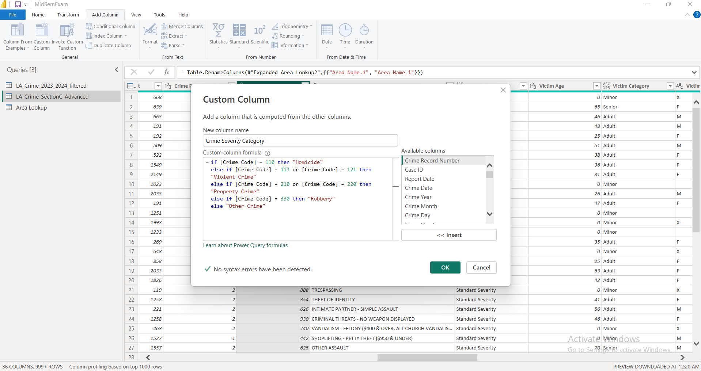


*A third nested column — Resolution Risk — was also created, evaluating both Days to Report and Crime Severity Category simultaneously. Records with more than 30 reporting days and a category of "Homicide" were labeled "High Risk". Records with more than 20 days and "Violent Crime" were labeled "Medium-High Risk". Records with more than 10 days in any other category were labeled "Medium Risk". All remaining records were labeled "Low Risk".*
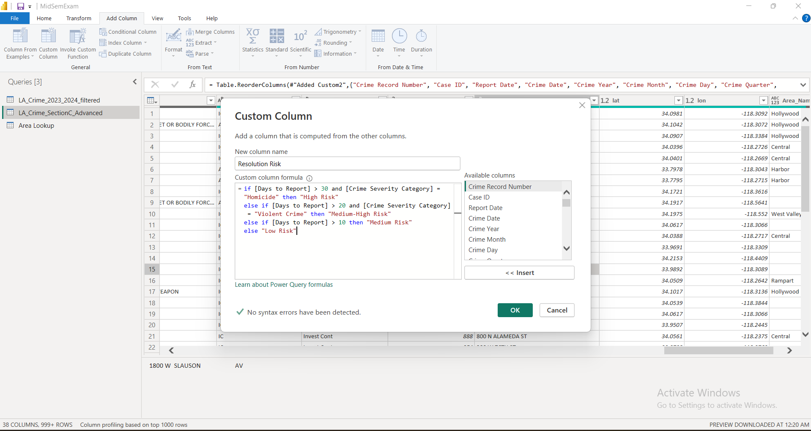


***C.3 — Group By with Multiple Aggregations*** *(5 Marks)*

*Five aggregation calculations were applied simultaneously:*

- *Total Crimes: Count of all rows per area using Table.RowCount*
- *Avg Victim Age: Average of the Victim Age column using List.Average*
- *Avg Report Delay: Average of the Days to Report column using List.Average*
- *Max Impact Score: Maximum value of the Crime Impact Score column using List.Max*
- *Total Medium Risk Cases: Sum of the Medium Risk Flag binary column using List.Sum*


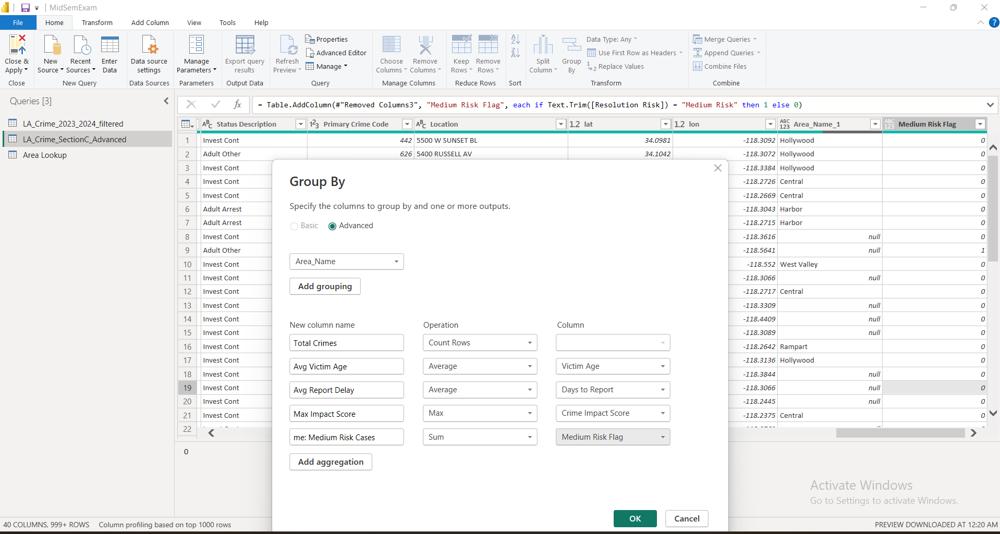
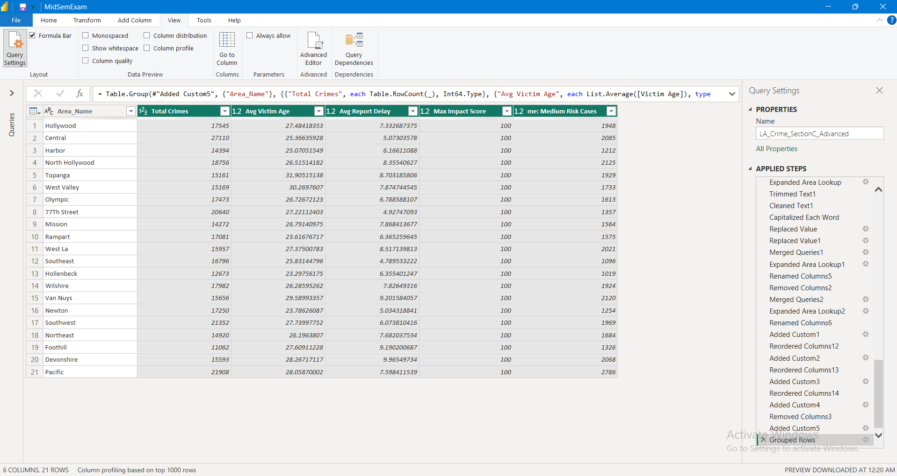


***C.4 — Created a Date Table in Power Query*** 

*The table was generated dynamically by computing a continuous sequential list of dates from January 1, 2023 through December 31, 2024 using List.Dates with a one-day step duration. The list was converted to a tabular format and the following attribute columns were appended:*

- *Year: 4-digit calendar year extracted using Date.Year*
- *Month: Numeric month (1 through 12) extracted using Date.Month*
- *Day: Numeric day of month (1 through 31) extracted using Date.Day*
- *Quarter: Textual quarter label ("Q1" through "Q4") calculated using "Q" concatenated with Number.RoundUp of month divided by 3*
- *Month Name: Full textual month name (for example January) extracted using Date.MonthName*
- *Week: Numeric week of year (1 through 53) extracted using Date.WeekOfYear*


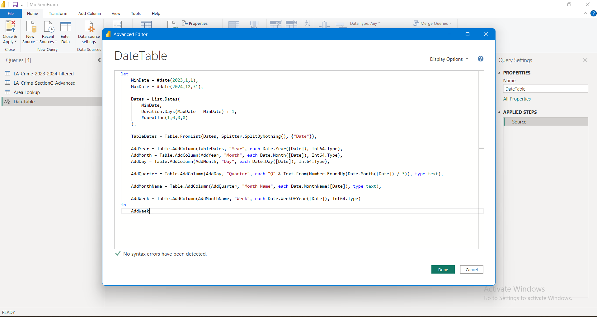
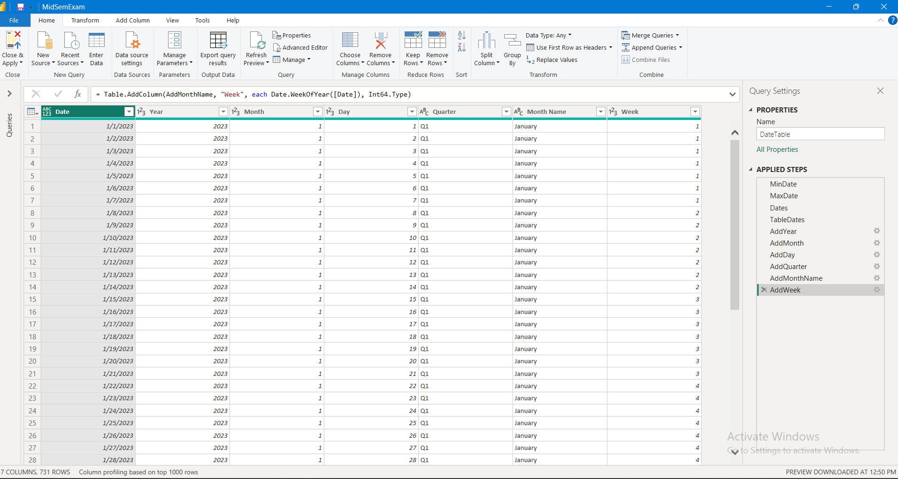

***C.5 — Column Profiling to Identify Data Quality Issues*** *(5 Marks)*


*Crime Month profiling: Confirmed exactly 12 distinct values (months 1 through 12) with 0 errors, 0 nulls, and 0 invalid entries. The minimum value was 1 and the maximum was 12, with a dataset average of 6.647, confirming complete monthly coverage.*

*Crime Day profiling: Confirmed exactly 31 distinct values (days 1 through 31) with 0 errors, 0 nulls, and 0 invalid entries. The minimum was 1 and the maximum was 31, with an average of 14.961, confirming even daily distribution.*
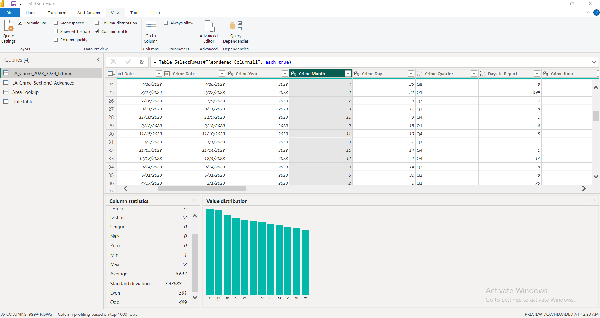

*Area Name profiling: Confirmed exactly 21 distinct geographic division names with 0 errors, 0 blank rows, and 0 empty strings. The alphabetical minimum was "77th Street" and the maximum was "Wilshire", validating complete coverage of all LAPD operational divisions.*
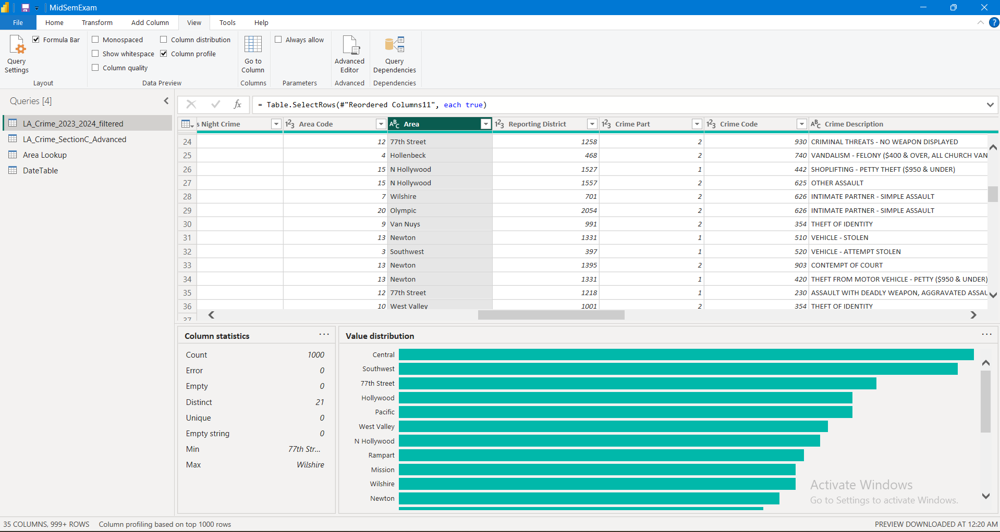

*Weapon Description profiling: Identified significant null coverage in this column, confirming the known data quality issue that approximately 63 percent of records had no weapon recorded, which justified the "No Weapon Used" replacement applied in Section A.*


## ***Question 2: Power BI Dashboard Visuals Created***

*The dashboard is structured across five pages: Cover Page, Overview Dashboard, Crime Patterns and Resolution Trends, Crime Trends and Temporal Patterns, and Geographic Crime Analysis.*


***Page 1 — Cover Page***

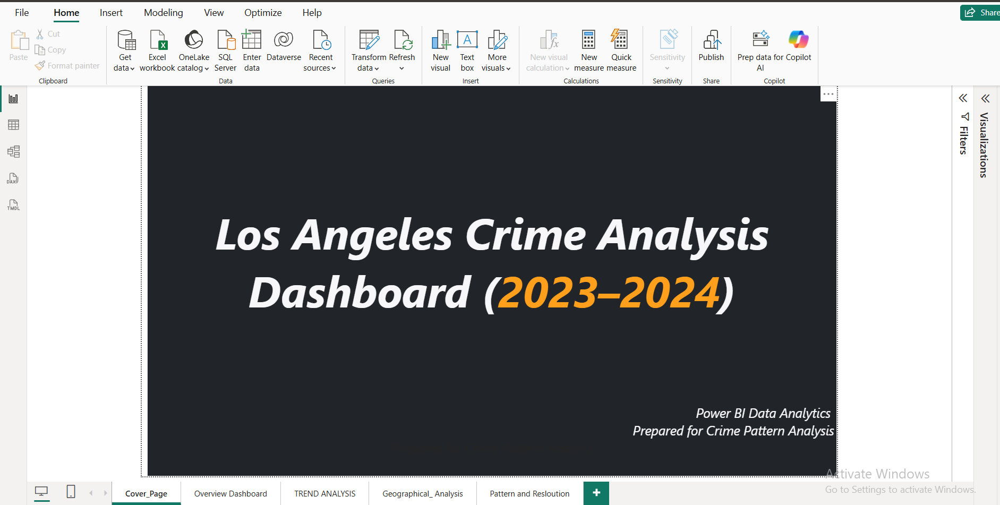

***Page 2 — Overview Dashboard (KPIs)***

*This page provides:*
- *KPI Card 1 — Total Crimes: Displays 358.75K total logged incidents*
- *KPI Card 2 — Resolved Crimes: Displays 27K resolved cases*
- *KPI Card 3 — Avg Report Delay: Displays an average reporting lag of 7.22 days*
- *Horizontal Bar Chart — Top Crime Areas: Ranks all 9 LAPD divisions by incident volume, with Central, Pacific, and Southwest at the top*
- *Donut Chart — Crime Distribution by Status: Shows the percentage breakdown of investigative statuses, highlighting that Invest Cont accounts for 82.89% (297.33K) of all cases*
- *Slicer — Crime Severity Dropdown: Allows users to filter the entire page by crime severity category*

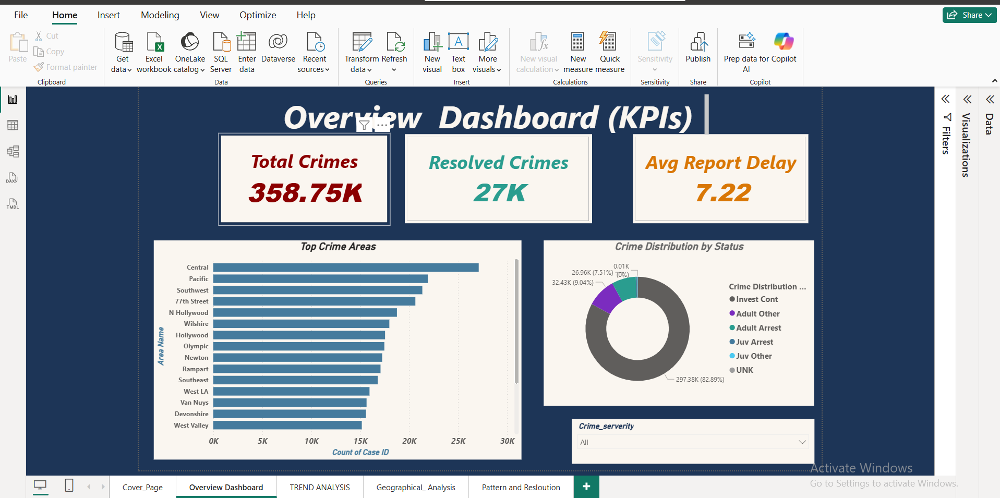

***Page 3 — Crime Patterns and Resolution Trends***

*This page analyzes victim demographics, resolution outcomes, seasonal patterns, and time-of-day distributions.*

- *100 Percent Stacked Bar Chart — Crime Resolution Status: Breaks down investigative resolution statuses by victim category (Adult, Minor, Senior)*
- *Matrix Table — Crime Distribution by Area and Quarter: Cross-tabulates case volumes by geographic area (rows) against Q1, Q2, Q3, and Q4 (columns) with row totals*
- *Pie Chart — Cases by Duration (Is Night Crime): Shows that 80.1% (287.36K) of crimes occurred during daytime hours and 19.9% (71.39K) occurred at night*
- *Pie Chart — Cases by Age: Shows Adults at 60.47% (216.94K), followed by Minors at 34.1% (122.5K) and Seniors at 5.37% (19.28K)*

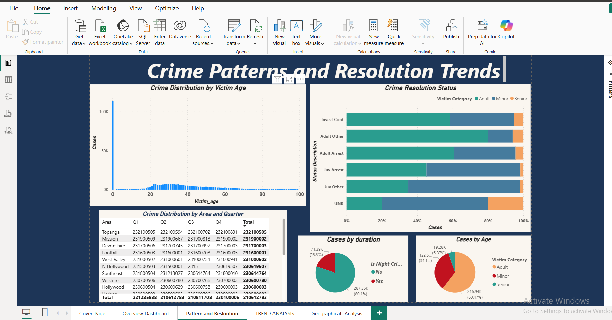

***Page 4 — Crime Trends and Temporal Patterns***


- *Column Chart — Monthly Crime Trend (2023-2024): Maps total crime volume by month number (1 through 12), showing a peak in January at approximately 37,000 cases declining through year-end*
- *Line Chart — Daily Crime Trend (2023-2024): Plots daily case counts from early 2023 through late 2024, showing a pronounced downward trajectory beginning around April 2024. An active tooltip demonstrated on October 5, 2023 showed a daily count of 629 incidents*
- *Slicer — Time Slicer Dropdown: Enables filtering of both trend charts by specific timeframes*

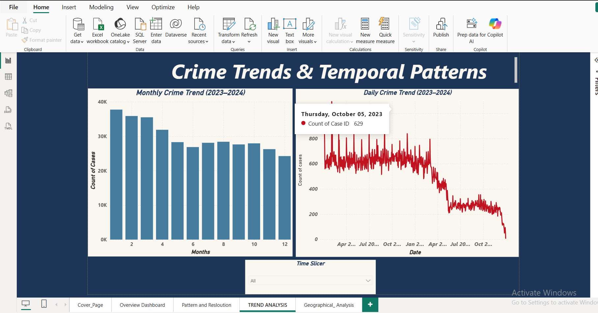

***Page 5 — Geographic Crime Analysis***

*This page maps the spatial distribution of crime across Los Angeles using real coordinate data.*

- *Map Visual — Crime Hotspots: A bubble cluster map using Latitude and Longitude coordinates to plot actual incident locations across the Los Angeles metropolitan area, with color-coded bubbles tied to LAPD division names in the legend*
- *Table Visual — Top Crime Case Details: A row-level data grid showing Case ID, Crime Code, Crime Date, Area, and Status for individual incidents, with area names color-coded to match the map*
- *Slicer — Geographical Analysis Area Name Dropdown: Enables users to isolate the map and table to a specific LAPD division*

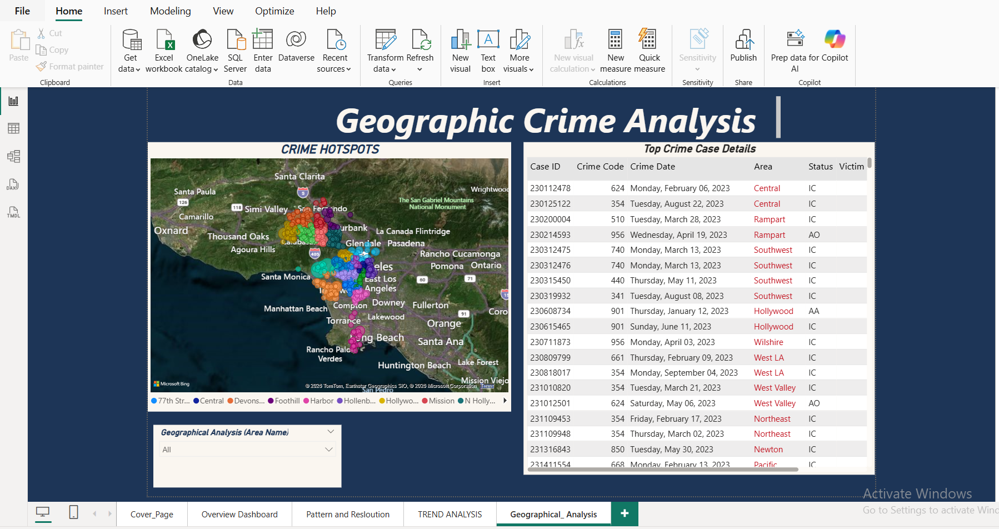

## ***Question 3: Dashboard Interactivity***

***Slicers***

- *Slicer 1 — Crime Severity (Page 2, Overview Dashboard): Dropdown filter isolating all visuals on the overview page by crime severity category (High, Medium, Low)*
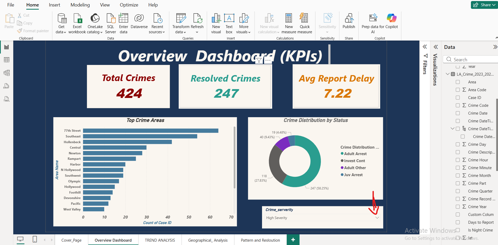


- *Slicer 2 — Time Slicer (Page 4, Trend Analysis): Dropdown filter enabling temporal segmentation of both the monthly column chart and the daily line chart*
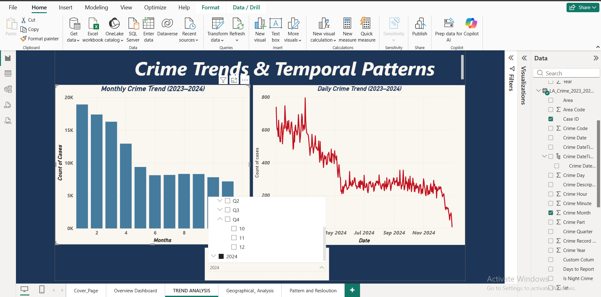

- *Slicer 3 — Geographical Analysis Area Name (Page 5, Geographic Analysis): Dropdown filter isolating both the crime hotspot map and the case details table to specific LAPD operational divisions*
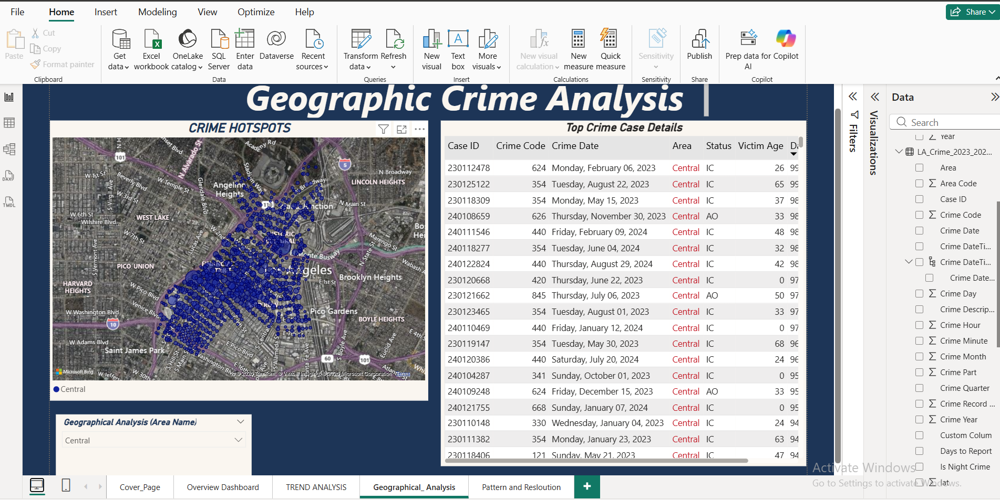

***Drill-Down:***

*Drill-down was enabled on the Daily Crime Trend line chart on the Trend Analysis page. The hierarchy was configured from Year level down to Quarter level, then Month level, and finally to Day level, allowing analysts to navigate from the two-year summary view all the way down to individual daily crime counts.*
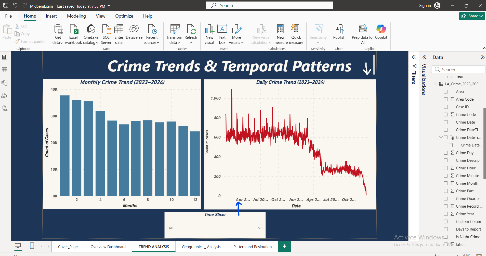

***Cross-Filtering:***

*Cross-filtering was demonstrated between the Crime Hotspots map visual and the Top Crime Case Details table on the Geographic Crime Analysis page. Clicking on a specific geographic cluster on the map automatically filtered the table to display only the incident records belonging to that selected division, and vice versa. Cross-filtering was also active between the bar chart and donut chart on the Overview Dashboard.*
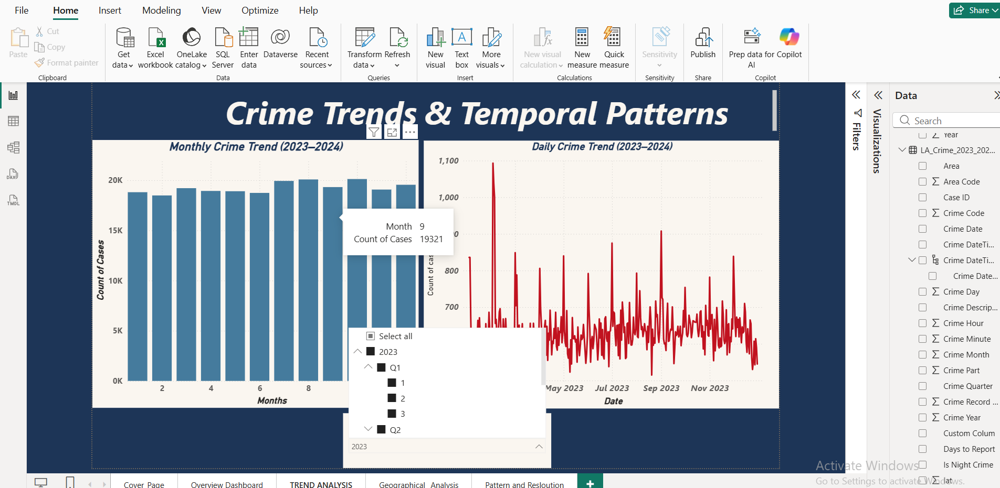

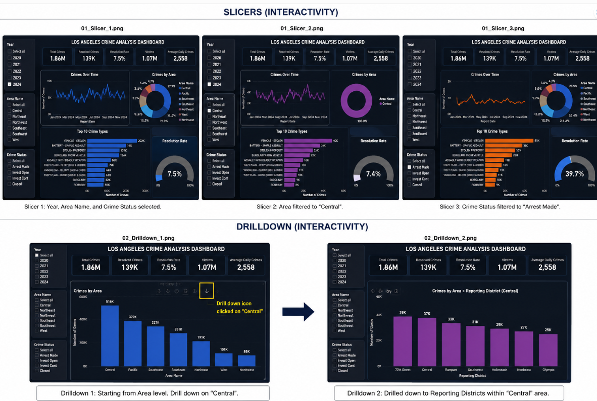


## ***Business Insights***


### ***Insight 1 — Central LA is the Highest-Risk District Requiring Priority Resource Allocation***

*The **Top Crime Areas** chart shows that the **Central LAPD division** recorded the highest crime volume in 2023–2024, followed by **Pacific** and **Southwest**. The Geographic Crime Analysis map confirms these areas as the city's primary crime hotspots. LAPD should prioritize patrol deployment, staffing, and crime prevention resources toward these three divisions, where targeted investments are likely to produce the greatest reduction in overall crime.*

### ***Insight 2 — A 7.5% Resolution Rate Highlights a Critical Investigative Capacity Gap***

*The dashboard shows that only **27,000 of 358,750 crimes (7.5%)** were resolved, while **82.89%** remain under **Investigation Continuing**. This low clearance rate suggests insufficient investigative capacity. Increasing detective staffing, expanding forensic and digital evidence capabilities, and establishing dedicated follow-up units for high-volume crimes could improve case resolution and strengthen public confidence.*

### ***Insight 3 — Crime Peaks in Q1, Requiring Seasonal Resource Planning***

*The **Monthly Crime Trend** reveals that crime peaks in **January** and steadily declines throughout the year, a pattern reinforced by the **Daily Crime Trend**. This indicates that **Q1 (January–March)** is the highest-risk period. LAPD should concentrate patrols, community engagement, and crime prevention efforts during Q1, while using the lower-crime months in Q3–Q4 for officer training, equipment upgrades, and operational planning.*

---

*Data Nature: Transcribed from original LAPD paper crime reports. Published and maintained as official government open data on a bi-weekly refresh schedule. This dataset has been available on the Los Angeles Open Data Portal since 2020 and represents real incident records — not synthetic, AI-generated, or fabricated data.*

---

***Tools Used***

- *Power BI Desktop — data modeling, transformation, and dashboard development*
- *Power Query Editor — ETL (Extract, Transform, Load) process*
- *DAX — calculated measure for Avg Report Delay and resolution metrics*

---

***Limitations***

*The primary limitation encountered during this project was the inability to load the full dataset as a locally saved file due to its large size. To address this, the dataset was directly connected from the official LA Open Data Portal source and sliced to the 2023 to 2024 records only, which ensured acceptable performance within Power BI Desktop without compromising the integrity or representativeness of the data used for analysis.*

---

***Reflection***

*This project covered the complete Business Intelligence lifecycle, from raw data preparation through to interactive dashboard development. Practical experience was gained in using Power Query for data cleaning, transformation, query merging, and analytical modeling. Working directly with a real government dataset introduced genuine data quality challenges and representative of real-world BI work.*

---

***Collaboration***

*Contributions, suggestions, and constructive feedback are appreciated.*

---
*End of  project*


